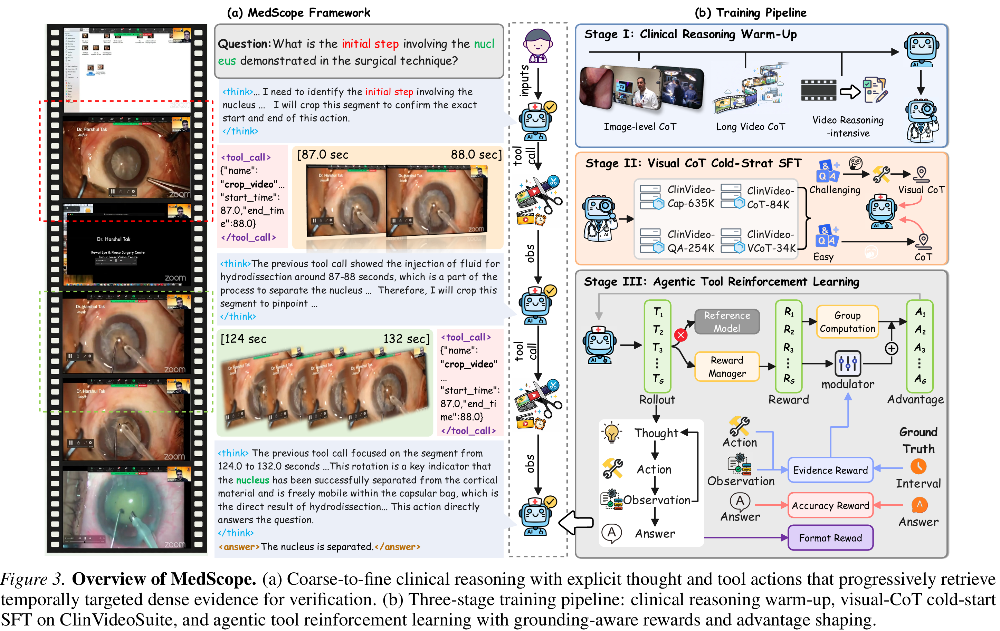
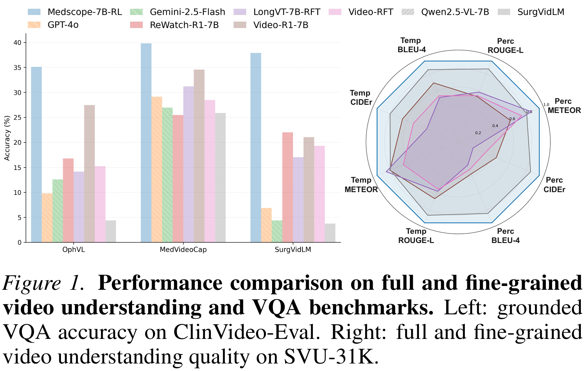
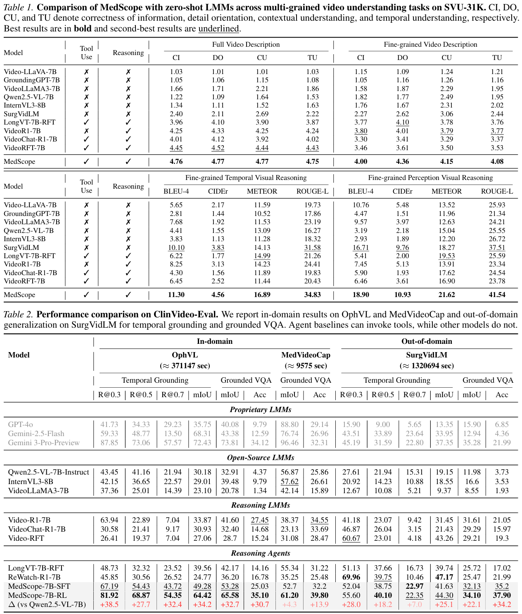
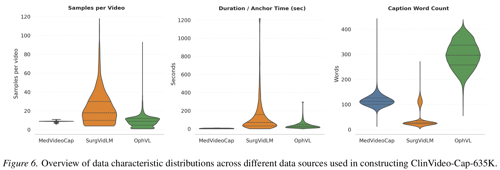

<div align="center">

# MedScope

**Incentivizing "Think with Videos" for Clinical Reasoning via Coarse-to-Fine Tool Calling**

[](https://icml.cc/Conferences/2026)
[](https://arxiv.org/abs/2602.13332)
[](https://github.com/SII-WenjieLisjtu/MedScope)
[](LICENSE)
[](https://www.python.org/)
[](https://pytorch.org/)

</div>

<div align="center">

 &nbsp;&nbsp;&nbsp;&nbsp;
 &nbsp;&nbsp;&nbsp;&nbsp;
 &nbsp;&nbsp;&nbsp;&nbsp;


</div>

---

<div align="center">
  <a href="https://arxiv.org/abs/2602.13332">[arXiv Paper]</a> &nbsp;|&nbsp;
  <a href="README.zh.md">🇨🇳 中文</a> &nbsp;|&nbsp;
  <a href="#citation">[Citation]</a>
</div>

---

## 📰 News

- 🎉 **2026.05** — Our paper is accepted by **ICML 2026**! We will present MedScope at the 43rd International Conference on Machine Learning. 🎊🥳✨

---

## 🏗️ Overview

**MedScope** is a tool-using clinical video reasoning model that enables doctors to **"think with videos"** through iterative, coarse-to-fine evidence seeking and verification over long-form medical procedures. Unlike conventional multimodal large language models that passively sample videos, MedScope interleaves intermediate reasoning with targeted tool calls to iteratively locate, verify, and justify predictions with temporally grounded visual evidence.

This repository contains the official implementation of our ICML 2026 paper:
> **MedScope: Incentivizing "Think with Videos" for Clinical Reasoning via Coarse-to-Fine Tool Calling**  
> Wenjie Li\*, Yujie Zhang\*, Haoran Sun, Xinqi He, Hongcheng Gao, Chenglong Ma, Ming Hu, Guankun Wang, Shiyi Yao, Renhao Yang, Hongliang Ren, Lei Wang, Junjun He, Yankai Jiang

---

## 🏗️ Framework

<div align="center">
  
  <p><em>Figure 1. Overview of MedScope. (a) Coarse-to-fine clinical reasoning with explicit thought and tool actions. (b) Three-stage training pipeline: Clinical Reasoning Warm-up, Visual-CoT cold-start SFT, and GA-GRPO agentic RL.</em></p>
</div>

---

## 🌟 Key Contributions

1. **Medical Visual Chain-of-Thought Paradigm**  
   We propose a "think with videos" paradigm and instantiate it with **MedScope**, a tool-using LMM trained via a three-stage pipeline (warm-up, visual-CoT cold-start, and grounding-aware GRPO) that elicits coarse-to-fine clinical reasoning.

2. **ClinVideoSuite: Evidence-Centric Data Suite**  
   We build a large-scale, evidence-centric clinical video suite for training and evaluation, including **ClinVideo-Eval**, a fine-grained long-form medical video reasoning benchmark with traceable evidence. The suite comprises:
   - **ClinVideo-Cap-635K**: 634.8K timestamped dense captions
   - **ClinVideo-QA-254K**: 253.8K evidence-grounded QA pairs with localized supervision windows
   - **ClinVideo-VCoT-34K** / **ClinVideo-CoT-84K**: Tool-augmented visual CoT trajectories

3. **GA-GRPO: Grounding-Aware RL**  
   We introduce **GA-GRPO** (Grounding-Aware Group Relative Policy Optimization), an agentic RL recipe with grounding-aligned rewards and adaptive advantage modulation to promote temporally aligned tool use and encourage diverse reasoning under varying video conditions.

---

## 📊 Main Results

MedScope achieves **state-of-the-art** performance among open-source models on both in-domain and out-of-domain evaluations.

**SVU-31K (Multi-grained Video Understanding)**
- Full Video Description: **4.76** DO (state-of-the-art)
- Fine-grained Temporal Reasoning: **11.30** BLEU-4, **4.56** CIDEr
- Fine-grained Perception: **18.90** CIDEr, **10.93** METEOR

**ClinVideo-Eval (Grounded Clinical Video Reasoning)**
- OphVL Temporal Grounding: **64.42** mIoU
- MedVideoCap Grounded VQA: **65.58** mIoU
- Strong generalization to out-of-domain **SurgVidLM**

<div align="center">
  
  <p><em>Figure 2. Performance comparison on full and fine-grained video understanding and VQA benchmarks.</em></p>
</div>

<div align="center">
  
  <p><em>Table 1. Performance comparison on ClinVideo-Eval (in-domain and out-of-domain).</em></p>
</div>

---

## 📊 Dataset Statistics

<div align="center">
  
  <p><em>Figure 3. Overview of ClinVideoSuite data characteristics across MedVideoCap, SurgVidLM, and OphVL.</em></p>
</div>

---

## 🚀 Quick Start

> 🚧 **Coming soon!** The code, model checkpoints, and detailed usage instructions will be released shortly. Stay tuned!

---

## 📁 Project Structure

Once fully released, the repository will be organized as follows:

```
MedScope/
├── README.md                 # Project documentation
├── README.zh.md              # Chinese documentation
├── requirements.txt          # Python dependencies
├── setup.py                  # Package installation
├── medscope/                 # Core package
│   ├── models/               # Model architectures
│   ├── trainers/             # Training loops (SFT, GA-GRPO)
│   ├── data/                 # Data loaders & preprocessing
│   ├── tools/                # Tool definitions & executors
│   └── utils/                # Utility functions
├── scripts/                  # Training & evaluation scripts
│   ├── train_sft.py          # Warm-up & Visual-CoT SFT
│   ├── train_grpo.py         # GA-GRPO reinforcement learning
│   └── evaluate.py           # Benchmark evaluation
├── configs/                  # YAML configuration files
│   ├── sft_warmup.yaml
│   ├── sft_coldstart.yaml
│   └── grpo.yaml
├── data/                     # Dataset directory
│   ├── clinvideo_cap/        # ClinVideo-Cap-635K
│   ├── clinvideo_qa/         # ClinVideo-QA-254K
│   ├── clinvideo_vcot/       # ClinVideo-VCoT-34K
│   └── clinvideo_eval/       # ClinVideo-Eval benchmark
├── checkpoints/              # Model checkpoints
└── assets/                   # Figures & logos
```

---

## 🤖 Model Card

| Attribute | Details |
|-----------|---------|
| **Model Name** | MedScope-7B |
| **Base Model** | [Qwen2.5-VL-7B-Instruct](https://huggingface.co/Qwen/Qwen2.5-VL-7B-Instruct) |
| **Model Type** | Vision-Language Model (VLM) with Tool Use |
| **Parameters** | ~7B |
| **Context Length** | 32,768 tokens |
| **Input Modalities** | Video, Text |
| **Output Modalities** | Text (reasoning + tool calls) |
| **Training Data** | ClinVideoSuite (Cap-635K, QA-254K, VCoT-34K, CoT-84K) |
| **License** | Apache 2.0 |

### Training Pipeline

MedScope is trained via a **three-stage pipeline**:

| Stage | Objective | Data | Description |
|-------|-----------|------|-------------|
| **Stage 1** | Warm-up SFT | ClinVideo-Cap-635K + ClinVideo-QA-254K | Supervised fine-tuning to build foundational clinical video understanding and reasoning capabilities. |
| **Stage 2** | Visual-CoT Cold-Start SFT | ClinVideo-VCoT-34K + ClinVideo-CoT-84K | Teaches the model to generate explicit intermediate reasoning chains and tool calls with temporally grounded evidence. |
| **Stage 3** | GA-GRPO RL | ClinVideo-Eval + sampled trajectories | Grounding-Aware Group Relative Policy Optimization with grounding-aligned rewards to refine tool-use precision and temporal alignment. |

### Key Hyperparameters

| Hyperparameter | Stage 1 (Warm-up) | Stage 2 (Cold-Start) | Stage 3 (GA-GRPO) |
|----------------|-------------------|----------------------|-------------------|
| Learning Rate | 2e-5 | 2e-5 | 1e-6 |
| Batch Size | 128 | 128 | 64 |
| Epochs | 3 | 3 | - |
| Warmup Ratio | 0.03 | 0.03 | - |
| LoRA Rank | 64 | 64 | 64 |
| LoRA Alpha | 128 | 128 | 128 |
| Group Size (GRPO) | - | - | 8 |
| KL Penalty (GRPO) | - | - | 0.04 |
| Reward Weights | - | - | Answer: 1.0, Grounding: 1.0, Format: 0.5 |

---

## 🎬 Demo

<div align="center">

| 🎬 Demo Video |
|:--:|
| *Demo video will be uploaded soon.* |

</div>

---

## 🗺️ Roadmap

| Milestone | Target Date | Status |
|-----------|-------------|--------|
| Paper (arXiv) | 2026.02 | ✅ Released |
| Code Release | 2026.06 | 🚧 In Progress |
| Model Release | 2026.06 | 🚧 In Progress |
| Dataset Release | 2026.07 | 🚧 In Progress |
| Demo Video | 2026.06 | 🚧 In Progress |

---

## 📦 Release Status

- [x] Paper (arXiv)
- [ ] **Code & Models** — *Will be released soon. Stay tuned!*
- [ ] **ClinVideoSuite Dataset** — *Will be released soon.*

---

## 📖 Citation

If you find this work useful for your research, please consider citing our paper:

```bibtex
@inproceedings{li2026medscope,
  title={MedScope: Incentivizing "Think with Videos" for Clinical Reasoning via Coarse-to-Fine Tool Calling},
  author={Li, Wenjie and Zhang, Yujie and Sun, Haoran and He, Xinqi and Gao, Hongcheng and Ma, Chenglong and Hu, Ming and Wang, Guankun and Yao, Shiyi and Yang, Renhao and Ren, Hongliang and Wang, Lei and He, Junjun and Jiang, Yankai},
  booktitle={Proceedings of the 43rd International Conference on Machine Learning (ICML)},
  year={2026}
}
```

---

## 🙏 Acknowledgements

This work is supported by Shanghai Innovation Institute, Shanghai Jiao Tong University School of Medicine, and Shanghai Artificial Intelligence Laboratory. We gratefully acknowledge the clinical data support from Ruijin Hospital.

---

## 📧 Contact

For questions or suggestions, please feel free to open an issue or contact the authors.

---

<div align="center">

 &nbsp;&nbsp;&nbsp;&nbsp;
 &nbsp;&nbsp;&nbsp;&nbsp;
 &nbsp;&nbsp;&nbsp;&nbsp;


<p><small>Shanghai Innovation Institute &nbsp;|&nbsp; Shanghai Jiao Tong University &nbsp;|&nbsp; Fudan University &nbsp;|&nbsp; LeapQuest</small></p>

</div>
